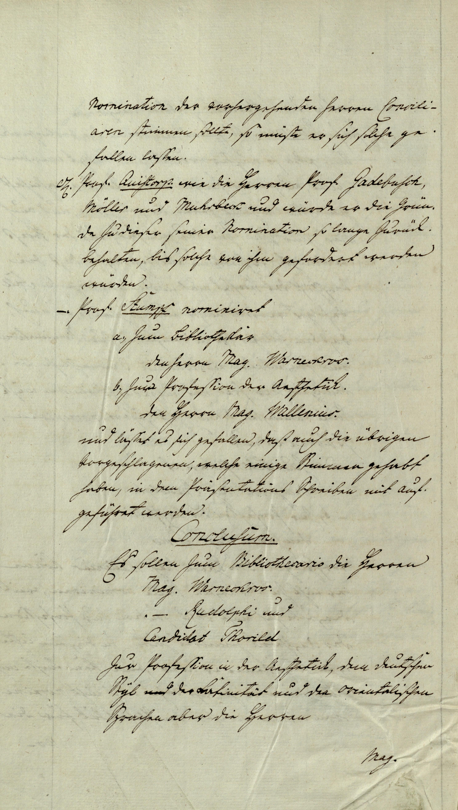
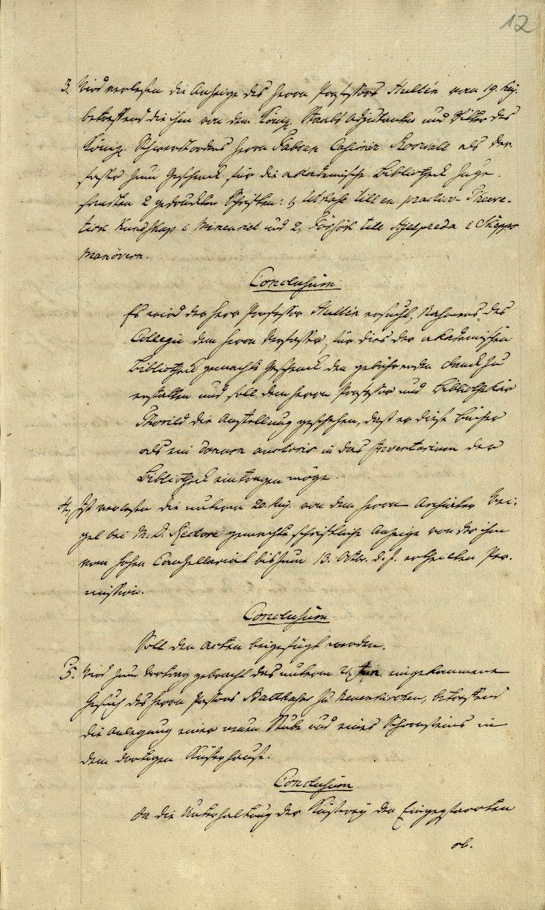
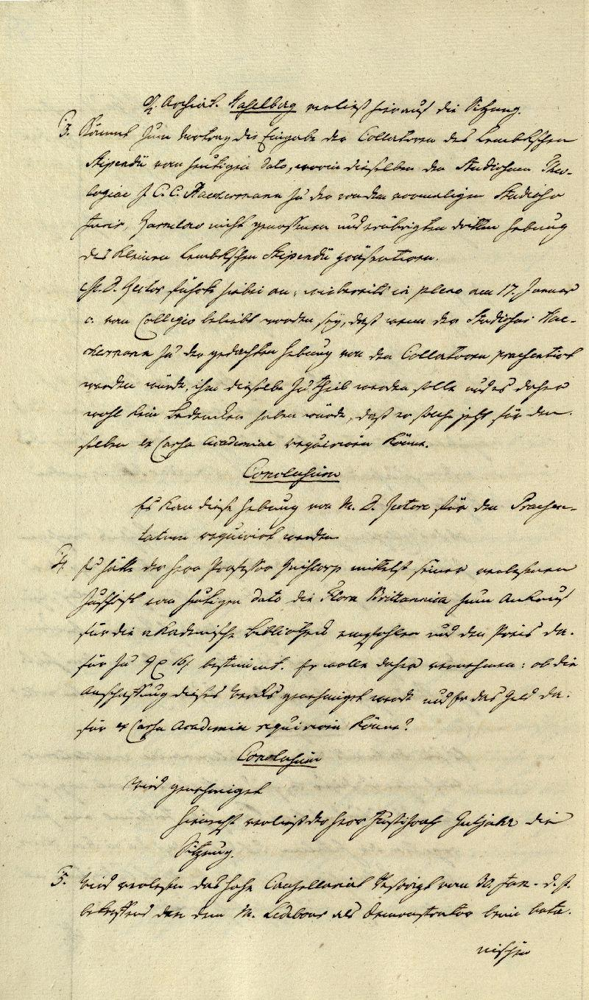

# KurrentVision 

## Checkpoint 1

### The Problem and Evaluation Plan:

In 1937, my grandfather, Joseph Moses, immigrated to New York from Berlin, Germany, leaving most all of his family behind. In the years after, he remained in contact with his family via handwritten letters, all in German, and most in the Kurrent script. In the later years of his life, my mother and I, armed with limited German knowledge, have attempted to transcribe and translate these letters to gain a deeper understanding into his life, family, and life udner a growing Nazi regime back home in the late 1930s. While we have had success with most of these saved letters, there remain ~25 letters beyond our grasp, due to their complicated scripting and Kurrent font.

In this project, I aim via 2 methodologies to transcribe these remaining letters:

1. First, I will continue to fine tune the [TrOCR Kurrent-Model](https://huggingface.co/dh-unibe/trocr-kurrent). This is a Transformer based model, originally trained on general text recognition by Microsoft, and subsequently fine-tuned on a series of 18th century Kurrent texts by researchers at the University of Bern. I will fine tune their model with both a selection of previous letters we have succesfully transcribed, as well as additional synthetic data I will generate.

2. Second, I will train a model from scratch. If time permits, I will also aim to use an encoder/decoder transormer arcitecture, but a CNN may also be used if there is not enough time to train the transformer. Again, this will use both the transcribed letters and synthetic data, but also heavily rely on the available Senatsprotokolle documents from between 1795-1840 from the University of Greifswald.

Given the nature of the problem, there are multiple levels of success criteria:

1. At a minimum, I would like to be able to use the trained model to transcribe the untranscribed letters, either as it or with additional human interventions from the base text output. However, this is a very quantitative measure, so I also define two baselines.

2. Improvement upon the TrOCR model via fine-tuning. Given the aim is to transcribe personal letters, does finetuning on a subsection of already transcribed letters improve character error rate (CER) for other personal letters? CER on transcribed letters using TrOCR can be compared before and after fine-tuning.

3. Improvement over baseline [Transkribus](https://www.transkribus.org/kurrent-transcription). Trnaskribus is a software that offers transcription services in German and other languages, including in the Kurrent script. However, the software is paid to use, and their baseline German model, while not fully open sourced, appears to LSTM based. The website claims the model has an ~8% CER. While we do not direclty have their testing set, we aim to match or exceed their error rate on our data.

### Available Data
Data for this project comes from three major sources:

1. Handwritten letters my family has saved. This is a dataset of ~75 images, a selection of which are shown below. Of these 75, a subset of them already have ground truths, and the rest serve as our ultimate test for which we hope to transcribe. The ground truths letters too, serve as an interesting data source, as they are untouched by any pre-trained models as well, and offer a direct fine tuning ability for the ultimate test set.

|  |  |  |
|---|---|---|

2. Digitale Bibliothek Mecklenburg-Vorpommern maintains a digital archive of the [Senatsprotokolle](https://www.digitale-bibliothek-mv.de/viewer/toc/PPNUAG_0_1/3/), a series of handwritten notes from the academic senate at the University of Greifswald ranging from 1659-1937. A subset of these records have been prepared with text bounding info and transcriptions, allowing for me to use them as training data. I have collected the 16 available years with bounding info ranging between 1795 and 1840. These images can be downloaded year by year via the src/data_collection/senatsprotokolle_collection/image_scraping.py, and the bounding files can be downloaded directly from the digital archive. A few of the images can be seen below:

|  |  |  |
|---|---|---|

3. Finally, I will use synthetic data for training + finetuning the proposed models. To generate this data, I am leveraging a python package called trdg which allows for the generation of text, and am creating said text with multiple Kurrent fonts downloaded from online. There are options in the package for image alterations like blur, background colors, rotations, etc. so the data generated should be valid and helpful for training purposes.Synthetic data can be generated from the src/data_collection/synthetic_text_generation/text_generator.py, where all the needed phrases are put into the data/synthetic_texts.txt file. While the parameters of this generation have not been determined yet, a few very simple images are shown below, simply showcasing the generation capability:

|  |  |  |
|---|---|---|

