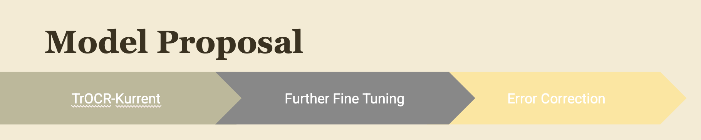
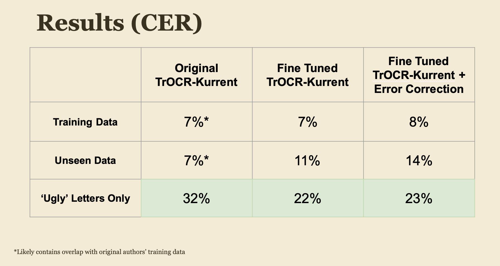
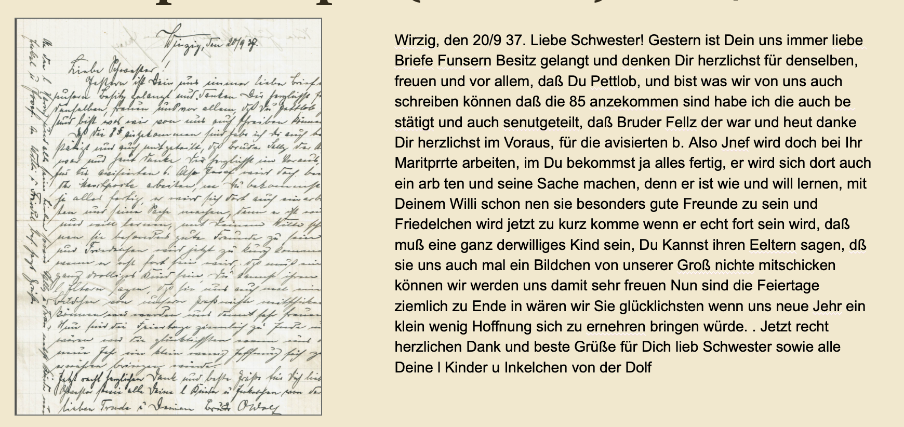
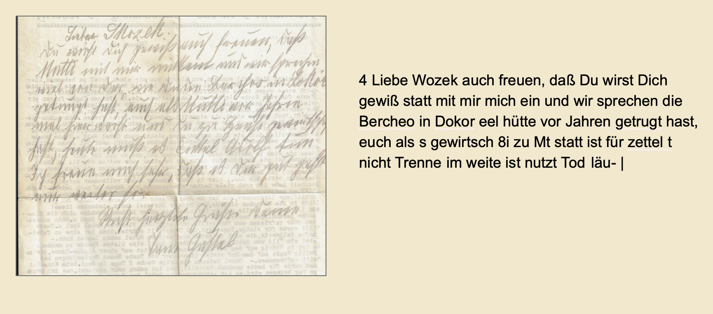

# KurrentVision 

## Checkpoint 1

### The Problem and Evaluation Plan:

In 1937, my grandfather, Joseph Moses, immigrated to New York from Berlin, Germany, leaving most all of his family behind. In the years after, he remained in contact with his family via handwritten letters, all in German, and most in the Kurrent script. In the later years of his life, my mother and I, armed with limited German knowledge, have attempted to transcribe and translate these letters to gain a deeper understanding into his life, family, and life udner a growing Nazi regime back home in the late 1930s. While we have had success with most of these saved letters, there remain ~25 letters beyond our grasp, due to their complicated scripting and Kurrent font.

In this project, I aim via 2 methodologies to transcribe these remaining letters:

1. First, I will continue to fine tune the [TrOCR Kurrent-Model](https://huggingface.co/dh-unibe/trocr-kurrent). This is a Transformer based model, originally trained on general text recognition by Microsoft, and subsequently fine-tuned on a series of 18th century Kurrent texts by researchers at the University of Bern. I will fine tune their model with both a selection of previous letters we have succesfully transcribed, as well as additional synthetic data I will generate.

2. Second, I will train a model from scratch. If time permits, I will also aim to use an encoder/decoder transormer arcitecture, but a CNN may also be used if there is not enough time to train the transformer. Again, this will use both the transcribed letters and synthetic data, but also heavily rely on the available Senatsprotokolle documents from between 1795-1840 from the University of Greifswald.

Given the nature of the problem, there are multiple levels of success criteria:

1. At a minimum, I would like to be able to use the trained model to transcribe the untranscribed letters, either as it or with additional human interventions from the base text output. However, this is a very quantitative measure, so I also define two baselines.

2. Improvement upon the TrOCR model via fine-tuning. Given the aim is to transcribe personal letters, does finetuning on a subsection of already transcribed letters improve character error rate (CER) for other personal letters? CER on transcribed letters using TrOCR can be compared before and after fine-tuning.

3. Improvement over baseline [Transkribus](https://www.transkribus.org/kurrent-transcription). Trnaskribus is a software that offers transcription services in German and other languages, including in the Kurrent script. However, the software is paid to use, and their baseline German model, while not fully open sourced, appears to LSTM based. The website claims the model has an ~8% CER. While we do not direclty have their testing set, we aim to match or exceed their error rate on our data.


### Available Data
Data for this project comes from three major sources:

1. Handwritten letters my family has saved. This is a dataset of ~75 images, a selection of which are shown below. Of these 75, a subset of them already have ground truths, and the rest serve as our ultimate test for which we hope to transcribe. The ground truths letters too, serve as an interesting data source, as they are untouched by any pre-trained models as well, and offer a direct fine tuning ability for the ultimate test set.

|  |  |  |
|---|---|---|


2. Digitale Bibliothek Mecklenburg-Vorpommern maintains a digital archive of the [Senatsprotokolle](https://www.digitale-bibliothek-mv.de/viewer/toc/PPNUAG_0_1/3/), a series of handwritten notes from the academic senate at the University of Greifswald ranging from 1659-1937. A subset of these records have been prepared with text bounding info and transcriptions, allowing for me to use them as training data. I have collected the 16 available years with bounding info ranging between 1795 and 1840. These images can be downloaded year by year via the src/data_collection/senatsprotokolle_collection/image_scraping.py, and the bounding files can be downloaded directly from the digital archive. A few of the images can be seen below:

|  |  |  |
|---|---|---|

3. Finally, I will use synthetic data for training + finetuning the proposed models. To generate this data, I am leveraging a python package called trdg which allows for the generation of text, and am creating said text with multiple Kurrent fonts downloaded from online. There are options in the package for image alterations like blur, background colors, rotations, etc. so the data generated should be valid and helpful for training purposes.Synthetic data can be generated from the src/data_collection/synthetic_text_generation/text_generator.py, where all the needed phrases are put into the data/synthetic_texts.txt file. While the parameters of this generation have not been determined yet, a few very simple images are shown below, simply showcasing the generation capability:

|  |  |  |
|---|---|---|

Beyond this, there are no major red flags in our data. This is classless, so there is no imbalance, and data is either synthetic or professionally generated, so there is data quality concerns either. 


### Evaluation Plan
With a data coming from multiple different sources, our data splitting with be a combination of inter and intra dataset splits. At a high level, I will create the standard train/val/test datset of all labeled data, and then we retain the final 'test' dataset of unlabeled data. The train/val/test datasets will consist of an approx even (by ratio) split of the real and synthetic data collected as described above, plus the pre-transcribed data from my grandfather. Once or model is trained, the final test set will consist of the untranscribed letters so see if we can acomplish the task at hand!

### Next steps
The immediate next step is the generation of the final dataset of synthetic data. Once this is complete and our final dataset is built, I will move onto the baseline models. This involves finetuning the downloaded TrOCR. Finally, once this is complete, I will move onto, assuming time and compute allows, to training my own model.


## Checkpoint 2
### Classical Baseline
For the shallow baseline, we use a simple linear model. Its inputs are a flattened RBG image, and its output is a vector of length max_len, where max_len is the length of the longest vector in the training data. This becomes in essense a character token prediction task, with padding tokens and EOS tokens included.

Because this model has no prior training, we train it on a combination dataset of the the collected Kurrent texts, as well as the synthetic data we generated, in approximately equal quantity to the kurrent texts. In all this was just under 10,000 text segments. That said, while this serves as a baseline of sorts, we do not expect it to be a very competitive one. This is because of the models simplicity, which will likely fail to fully capture the complex nature of writing as well as the spatial relationship inherient to a photo.

The model was was set up to train for 50 epochs, but it quickly became clear that, as expected, it was not learning to read the texts well. After fewer than 10 epochs, the loss plateaued, and minimal to no learning had occured. Plots outlining the learning process can be seen here for these 10 epochs:


As it can be seen, loss remains stagnant throughout the full training process, and character error rate (CER) is only ~10%. Because the simple linear baseline fails to learn anything meaningful about character recognition, we also move onto a second baseline - a pretrained KurrentOCR Model.

Qualitatively, we can also inspect a few example image texts and their prediction outputs. A subset are shown below:

```
true: 'Akademie quitiren zu wollen. Wäre'
  
pred: 'Auc e, gj idgc hgie lc  enloD  ou  a.ö,av cim.odsegn sme n ees ne- dnr-wteneeel-war<en'
---

true: 'mit den Professionen verbunden seyn,'

pred: 'Mac e,  j Eeac hHie     e  or  on  a. e  ccim.o.sein sme n eer nen dnr-wteneeel-war<en'
---

true: 'dies Cabinet aufzustellen seÿ, und endlich auch die'

pred: 'Aac eo  j Ee,c htie d   en or  on  a. e   ci¬l¬.sein sme noees nen dnr-wteneeel-war<en'
```

Again, we see that the model outpus are essentially nonsense. The model has no ability to distinguish texts from one another, which we can see in that all the outputs are the maximum length, and share similar characters with one another.

### KurrentOCR Model
For our deeper baseline, we use A pre-trained OCR model, finetuned by Jonas Widmer and Tobias Hode at the university of Bern. This model is a vision transformer originally trained in A paper called TrOCR: Transformer-based Optical Character Recognition with Pre-trained Models, and fine tuned by Microsoft on the IAM handwritting dataset, which contains more than 110k handwriting samples.

By using a much more complex model, and in particular one that can learn the spacial relationships of both an image and human handwriting, we would expect the accuracy of this baseline to be much stronger than the linear baseline. Because our Kurrent texts share much overlap with the training data from the previous Kurrent fine tuning, we continue fine-tuning with the only 'unseen' data that we have - the synthetic data. 

Due to the complexity of the model, training cost is much higher than the linear model. As such, while we will complete a full training fun for the final project, for the purposes of this checkpoint, we run a limited training run with N epochs. Additionally, with the final goal being utilizing the trained model on our untranscribed letters from my grandfather, we retain this model for predicting those letters until the full training run can be completed. The training metrics for the deeper baseline are shown below:

We quickly see that the ViT model is much much better than the linear model, even with the very shortened training run. Average loss is much loer, and the CER is in the 2-3% range! This will be quite a difficult baseline to outdo, and even on it's own it would likely offer significant transcription abilities on our final test set, but it does set out a fun challenge to try and improve the model with a longer training run with synthetic data and eventually some already transcribed Kurrent letters from my grandfather. 

Finally, like before, we can also show a quantitave list of transcription attempts. They can be seen below:

```
true: 'Muth'
pred: 'Muth'

true: 'erneuert'
pred: 'erneuert'

true: 'Gebote'
pred: 'Gebote'

true: 'dem großen Betsaale des Zuchthauses ihr Gebet mit'
pred: 'dem großen Tatsaale des Zuchthauses ihr Gebet mit'

true: 'schwarze'
pred: 'schwarze'
```

Again, the ViT model shows not only great relative prediction improvement, but also great absolute prediction power. The model, albiet in a small sample was able to mostly accurately predict all 5 images's texts!

### Failure Analysis
Finally, when we think high level about what goes right or wrong with the models, the differences are pretty strightforward, as again, the linear model does not have the complexity to generate accurate predictions. Thus, 'everything' fails. There are not specific patterns or types of images that it does better worse at, because the model is simply unequiped for the task at hand.

On the other hand, the ViT doesn't have a ton that it fails with, as its CER is ~2%. After looking through some specific images, there are not necessarily character patterns that it does better or worse with, but often it struggles more with some of our blurrier images. While some blur/randomness is aimed at helping the model learn, we might alter the generation of synthetic data moving forward as our final test dataset of untranscribed letters while not pretty in handwriting is not specifically blurry. Thus the blurry training data may not help as much as we intend.


## Checkpoint 3

### Final Data
For checkpoint three, we pull out all the stops and attempt to train the most accurate model possible. The first in this process is generating the final synthetic data that will feed into model training alongside the letters from my grandpa. As a part of the synthetic generation process, we must think critically about how to generate data that 'matches' the letters as close as possible in look and feel. With this in mind, we attempt to control a few things including the font, the background, and the language used. To match the font, I generate data using an online Kurrent font as described in an earlier checkpoint. To control the background, I randomly sample tan-ish colors from a range that is similar to the letters and apply them rather than a white background, and finally to match the language used, I sample texts from a German novel written as a series of letters between family, which again is the same premise as the letters I attempt to translate. The book is Briefe an einen jungen Maler, written in the 1920s by Rainer Maria Rilke. Below are a few example pictures of the synthetic data, also with blur included.


|  |  |  | 
|---|---|---|

### Final Model Pipeline
As compated the previous iterations, we not only train the main model on a deeper dataset, but we also expand the modeling process into a 2-stage model. First, as previously explained, we fine tune the Tr-OCR Kurrent model to make hopefully better predictions. However, on top of this I also introduce a 2nd error correction model that we train on the 1st stage outputs and ground truths. This model is a finetuned MBART-50, which itself is an encoder/decoder text to text model with the BART architecture. The model is fine tuned on the Falko-MERLIN german error correction dataset. This two stage model will in theore help solve two problems. First, there is some irreducable error in translating the images to text. It could be degredation of the ink, bad handwriting, etc... By including the error correction, we are able to remove some of that error by only learning directly from the language aspect, rather than the 'real physical' aspect. Second, even without irreducable error, the only way for me to get ground truths for some of my letters was to use an available paid, online model to transcribe them. If these models are not perfect, which I wouldnt expect them to be, they once again will introduce bias into our first stage model. This bias, similar to the irreducable physical error, can be mitigated by running text outputs through a language only model. A graph explaining the final model pipeline can be seen below:



### Results and Model Comparisons
After training the models, we are left with three models that we can compare against one another. First is the baseline TrOCR Kurrent, the second is the further finetuned TrOCR Kurrent, and the final is the fine tuned model with the error corrections. A summary of the results against each dataset can be seen below:



When looking through the results, two things become immedietly clear. First, when looking at the dataset in the bottom row of the unseen letters from my grandpa, labeled as 'ugly' because they are more difficult to read than the rest of the data used in the project, the model is actually learining a good amount in how to read them! Character Error Rate (CER) drops nearly 30%. That said, it is still around 22-23 percent, again because there is still a fair amount of irreducable error in the data.

The second thing that stands out is that the error correction model is not working super well. In fact, the CER for those runs is actually a little higher than without it. I believe the main reason for this, is that the specific model we are using, while powerful, might not be correctly suited for the problem at hand. The model is techincally trained to correct grammer. While this might be helpful for some outputs, most often the errors we see from the models are simply incorrect characters resulting in non-words, which are not a grammer issue and are likely to not be corrected by this model. For this reason, we consider the 'final' model for the purposes of this project to be the Fine Tuned TrOCR the we have further finetuned. That said, due to the reasons outlined above, I do still believe that there is good reason to find and implement a more direct error correction model in future work. With the final model in hand, we can also take a closer look at its outputs and identify cases in which it works and does not work. 

#### Successful Transcription

In the above image, we can see the original letter and outputted transcription for one of the most successful transcriptions in the dataset, with a CER of 0.04. This was a bit of a suprising letter to me for such a low CER given its still is a pretty wavy current font, but it is a fairly clean one too. Looking at the transcription, it appears pretty clean at first glance. There are a few words spelled wrong, but for the most part everything is words and they generally 'fit together' to make real sentances. As a fun side experiement, I took the output transcription, errors and all and pasted it directly into Google Translate to see if it was close enough to also tackle the translation problem. The result is as follows:

```
Wirzig, September 20, 1937. Dear Sister! Yesterday, your letter—always so dear to us—arrived safely, and we thank you most sincerely for it. We are especially happy that you are, thank God, in good health—something we can also say of ourselves. I have confirmed that the 85 [marks] have arrived, and I also let you know that Brother Fellz was here. Today, I thank you most sincerely in advance for the books you mentioned sending. So, Josef will indeed be working at your marketplace; you seem to have everything well organized! He will surely settle in there and make a success of things, for he is eager and willing to learn. He and your Willi already seem to be particularly good friends. Little Friedel will surely miss him once he has truly left; she must be such a delightful child! You can tell her parents that they are welcome to send us a little photo of our great-niece sometime; it would give us great joy. Now the holidays are drawing to a close; we would be the happiest people in the world if the New Year were to bring us even a glimmer of hope for making a living. And now, my heartfelt thanks and best wishes to you, dear Sister, as well as to all your children and grandchildren. —Dolf

```

#### Unsuccessful Transcription

In this photo, which has a CER of 0.40, we see a number of different errors. There are incomplete and incorrect words, single letters interjecting words, and even unlikely characters including '|'. While the result in not good, I am not terribly suprised given the letter though. The font is super faded, and it was clearly written on the backside of a typed letter, which may also be confusing the model with the previously written text. Some of this 40% is likely irreducable error that further training on the synthetic data is unlikely to mitigate.


## Further Work
There are a number of extensions to this work that I will likely continue in the future. First, I am currently in contact with the researchers at UBern to share updates on this project, and hopefully gain access to their exact datasets, which could help align my model with their work before expanding even more. Second, I would like to introduce more Kurrent fonts into the synthetic data generation pipeline, ideally including one based on the actual handwriting style of the letters themselves. Third, as noted above, the error correction model leaves room for improvement. I believe a more direct language model, rather than a grammar corrector, may be better at fixing the types of character level errors we see. Finally, I would like to improve the inference pipeline to include automatic bounding box generation, which would end the need for manual segmentation when transcribing new letters.

## Citations
- Rainer Maria Rilke *Breife an einen jungen Mahler*, ~1920-26
- MRNH. “MRNH/Mbart-German-Grammar-Corrector · Hugging Face.” Huggingface.co, huggingface.co/MRNH/mbart-german-grammar-corrector.
- READ-COOP SCE. “Read Kurrent Handwriting with AI | Transkribus.” Transkribus, 2026, www.transkribus.org/kurrent-transcription. Accessed 2 May 2026.